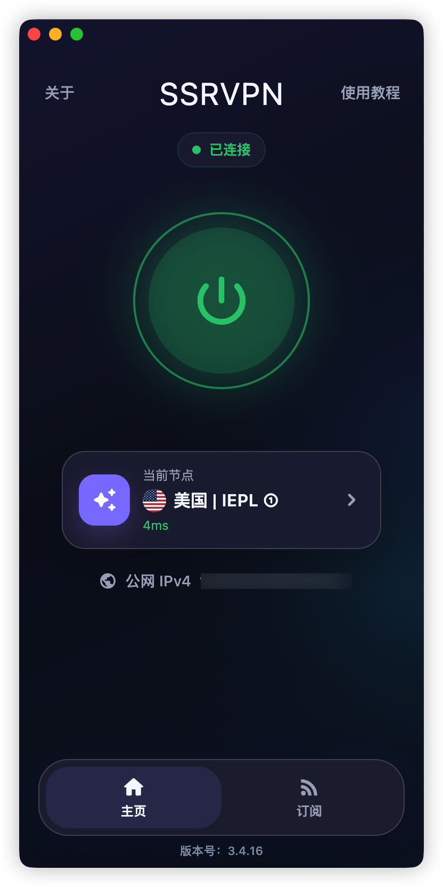

<div align="center">

# SSRVPN

**简单、开源、跨平台的 Mihomo VPN / 代理客户端**

Android、macOS、Windows 三端一致的连接体验：导入订阅，选择节点，一键连接。

**SSRVPN is an open-source, cross-platform Mihomo (Clash Meta) VPN and proxy client for Android, macOS and Windows.**

[](https://github.com/Elegying/SSRVPN/releases/latest)
[](https://github.com/Elegying/SSRVPN/actions/workflows/ci.yml)
[](LICENSE)
[](#下载)

[立即下载](#下载) · [官方网站](https://ssrvpn.vip/) · [使用指南](docs/USER_GUIDE.zh-CN.md) · [故障排查](docs/TROUBLESHOOTING.zh-CN.md)



</div>

## SSRVPN 是什么

SSRVPN 是面向 Android、macOS 和 Windows 的开源 Mihomo 客户端。它把常用功能收敛为清晰的“主页 + 订阅”两页流程，适合希望快速导入订阅或节点、查看延迟并稳定连接的用户。

本仓库提供客户端源代码和安装包，不提供代理节点或订阅服务。使用前需要准备兼容 Mihomo 的订阅链接或节点链接。

## 为什么选择 SSRVPN

- **三端一致**：Android、macOS、Windows 使用统一的订阅、节点和路由逻辑，换设备也无需重新学习。
- **开箱即用**：导入订阅或节点链接，完成刷新与测速后即可选择节点并连接。
- **连接方式完整**：Android 使用系统 VPN；macOS 和 Windows 支持系统代理与 TUN。
- **更新可验证**：正式安装包同时提供 SHA-256 校验文件和发布来源记录。
- **诊断不泄密**：内置带错误编号和操作建议的脱敏诊断报告，便于定位连接问题。

## 下载

| 平台 | 安装包 | 连接方式 | 下载 |
| --- | --- | --- | --- |
| Android | `SSRVPN.apk` | 系统 VPN | [下载最新版 APK](https://github.com/Elegying/SSRVPN/releases/latest/download/SSRVPN.apk) |
| macOS | `SSRVPN.dmg` | 系统代理、TUN | [下载最新版 DMG](https://github.com/Elegying/SSRVPN/releases/latest/download/SSRVPN.dmg) |
| Windows | `SSRVPN_Setup.exe` | 系统代理、TUN | [下载最新版安装器](https://github.com/Elegying/SSRVPN/releases/latest/download/SSRVPN_Setup.exe) |

也可以前往 [GitHub Releases](https://github.com/Elegying/SSRVPN/releases/latest) 查看版本说明、SHA-256 校验文件与发布来源记录。

> [!IMPORTANT]
> 请只从本仓库 Release 或 [SSRVPN 官网](https://ssrvpn.vip/) 下载。Android 正式包当前仅包含 arm64 核心；macOS 为免费 ad-hoc、未公证分发，Windows 为免费未签名分发，因此首次打开时可能出现 Gatekeeper 或 SmartScreen 提示。

## 快速开始

1. 下载对应平台的安装包，并核对 Release 中的 SHA-256。
2. 安装并打开 SSRVPN，导入兼容的订阅链接或节点链接。
3. 等待刷新与测速完成，选择可用节点。
4. 点击连接；以首页连接状态和系统 VPN、系统代理或 TUN 状态为准。

遇到问题时，从应用日志入口打开“诊断与运行日志”。报告会提供稳定错误编号、操作建议和经过大小限制与脱敏的可复制内容。不要在 Issue、PR 或公开聊天中粘贴原始订阅、节点密码或未脱敏日志。

更完整的操作说明：

- [公共用户指南](docs/USER_GUIDE.zh-CN.md)
- [Android 指南](SSRVPN_Android/USER_GUIDE.md)
- [macOS 指南](SSRVPN_MacOS/USER_GUIDE.md)
- [Windows 指南](SSRVPN_Windows/USER_GUIDE.md)
- [故障排查](docs/TROUBLESHOOTING.zh-CN.md)

三端均生成 IPv4/IPv6 双栈配置；公网 IPv6 是否可用取决于本地网络与节点。首页公网 IP 固定显示 IPv4，它不是 IPv6 连通性检测结果。

macOS TUN 的管理员授权只代表本机用户同意本次提权，不能让 macOS 验证发布者身份。本项目固定采用免费 ad-hoc/未公证分发，不购买 Apple 或 Windows 代码签名证书；用户必须从正式来源下载并核对 SHA-256。

## 开源与技术实现

SSRVPN 使用 Flutter 构建界面，并以 Mihomo 作为代理核心。三端共享订阅解析、节点模型、路由策略、配置生成和更新校验；原生 VPN、系统代理、托盘与安装流程保留在各平台目录。本 Monorepo 是唯一开发入口，历史平台仓库和旧审查报告只用于追溯，不代表当前能力。

```text
SSRVPN/
├── packages/ssrvpn_shared/    # 三端共享模型、服务、策略与测试
├── SSRVPN_Android/            # Flutter UI、Android VPN Service 与快捷磁贴
├── SSRVPN_MacOS/              # Flutter UI、系统代理、授权 TUN 与 DMG 打包
├── SSRVPN_Windows/            # Flutter UI、系统代理、TUN 与安装器
├── docs/                      # 当前文档、决策记录与历史审查材料
└── scripts/                   # 验证、资源、发布与维护脚本
```

## 开发与验证

推荐使用 Flutter `3.44.1` 或兼容 stable 版本。Android 构建还需要 Android SDK、NDK 与 JDK；macOS 需要 Xcode；Windows 需要 Visual Studio 2022 的“使用 C++ 的桌面开发”工作负载，安装器还需要 Inno Setup 6.5 或更高版本。

根目录统一入口：

```bash
make verify
```

它会检查版本与资源、职责边界、Android 内置 Kotlin、免费桌面分发策略、密钥扫描、发布工具、关键路径性能、依赖解析、静态分析、四套 Flutter 测试、Android 原生测试和覆盖率门槛。日常可按需执行：

```bash
scripts/workspace.sh pub-get
scripts/workspace.sh analyze
scripts/workspace.sh test
scripts/check-secrets.sh
scripts/performance-baseline.sh
```

行为、持久化、进程、系统代理、TUN 或打包发生变化时，还要在目标平台运行对应构建或安装冒烟；macOS 不能替代真实 Windows 的安装、升级和卸载验证。

## 发布

匹配 `v*` 的 tag 会触发 GitHub Actions 构建并上传三端产物及 SHA-256。macOS 始终生成 ad-hoc、未公证 DMG，Windows 只生成未签名安装器；仓库不保留付费桌面签名自动化。发布前必须保持 `main`、版本号、CHANGELOG 与资产清单一致，并在发布后重新下载校验。

详细流程见 [发布检查清单](docs/RELEASE_CHECKLIST.zh-CN.md)、[免费分发与签名说明](docs/RELEASE_SIGNING.md) 与 [OSS 运维手册](docs/OSS_RELEASE_OPERATIONS.zh-CN.md)。

## 文档与安全

[文档索引](docs/README.md) 区分当前规范、维护手册、架构决策与历史审查。项目状态以当前代码、自动验证和该索引中的有效文档为准。

不要在日志、Issue、PR、截图或崩溃报告中泄露订阅 URL、API secret、Bearer token、节点密码、服务端凭据或签名材料。安全问题请按 [SECURITY.md](SECURITY.md) 私下报告。

## 许可证

SSRVPN 基于 [MIT License](LICENSE) 开源。
