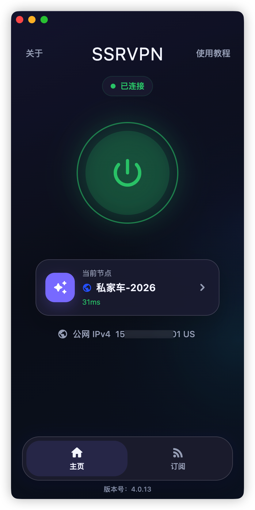
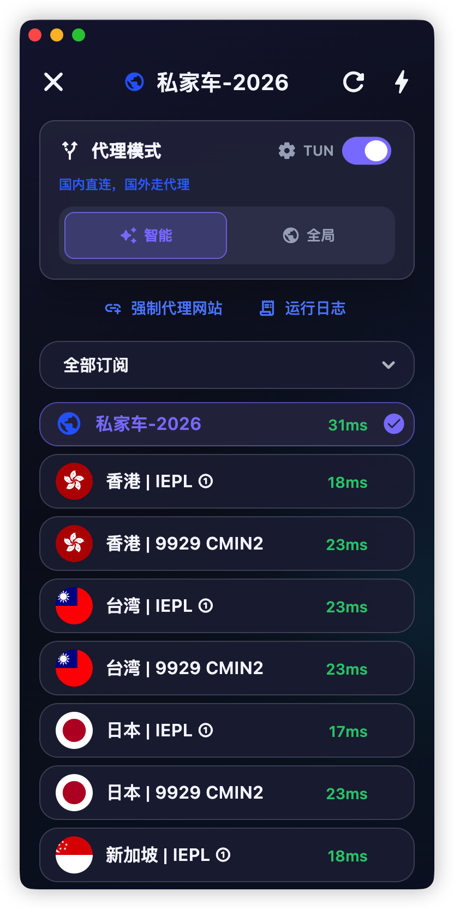

<div align="center">

# SSRVPN

**简单、开源、跨平台的 Mihomo VPN / 代理客户端**

Android、macOS、Windows 三端一致的连接体验：导入订阅，选择节点，一键连接。

**SSRVPN is an open-source, cross-platform Mihomo (Clash Meta) VPN and proxy client for Android, macOS and Windows.**

[](https://github.com/Elegying/SSRVPN/releases/latest)
[](https://github.com/Elegying/SSRVPN/actions/workflows/ci.yml)
[](SECURITY.md)
[](#许可证)
[](#下载)

[立即下载](#下载) · [使用指南](docs/USER_GUIDE.zh-CN.md) · [故障排查](docs/TROUBLESHOOTING.zh-CN.md) · [获取帮助](SUPPORT.md) · [参与开发](CONTRIBUTING.md) · [使用边界](ACCEPTABLE_USE.md)

下图为界面示意，版本号以 GitHub Release 和应用“关于”页为准。




</div>

## SSRVPN 是什么

SSRVPN 是面向 Android、macOS 和 Windows 的开源 Mihomo 客户端。它把常用功能收敛为清晰的“主页 + 订阅”两页流程：导入订阅、选择节点、点击连接，不要求用户先理解复杂的代理配置。

本仓库提供客户端源代码和安装包，不提供代理节点或订阅服务。使用前需要准备兼容 Mihomo 的订阅链接或节点链接。

## 为什么选择 SSRVPN

- **三端一致**：Android、macOS、Windows 使用统一的订阅、节点和路由逻辑，换设备也无需重新学习。
- **开箱即用**：导入订阅或节点链接，完成刷新与测速后即可选择节点并连接。
- **订阅兼容**：服务商拒绝默认客户端标识时，可按受控顺序兼容 Clash Verge、v2rayN 和 Shadowrocket；认证失败、地址失效或限流不会盲目重试。
- **连接方式完整**：Android 使用系统 VPN；macOS 和 Windows 支持系统代理与 TUN。
- **更新可验证**：正式安装包同时提供 SHA-256 校验文件和发布来源记录。
- **诊断默认脱敏**：内置带错误编号和操作建议的限长诊断报告；公开分享前仍应人工检查。

## 下载

| 平台 | 安装包 | 连接方式 | 下载 | SHA-256 |
| --- | --- | --- | --- | --- |
| Android 7.0+（arm64-v8a） | `SSRVPN.apk` | 系统 VPN | [下载最新版 APK](https://github.com/Elegying/SSRVPN/releases/latest/download/SSRVPN.apk) | [校验文件](https://github.com/Elegying/SSRVPN/releases/latest/download/SSRVPN.apk.sha256) |
| macOS 11+（Apple M 系列芯片） | `SSRVPN.dmg` | 系统代理、TUN | [下载最新版 DMG](https://github.com/Elegying/SSRVPN/releases/latest/download/SSRVPN.dmg) | [校验文件](https://github.com/Elegying/SSRVPN/releases/latest/download/SSRVPN.dmg.sha256) |
| Windows 10/11 x64 | `SSRVPN_Setup.exe` | 系统代理、TUN | [下载最新版安装器](https://github.com/Elegying/SSRVPN/releases/latest/download/SSRVPN_Setup.exe) | [校验文件](https://github.com/Elegying/SSRVPN/releases/latest/download/SSRVPN_Setup.exe.sha256) |

也可以前往 [GitHub Releases](https://github.com/Elegying/SSRVPN/releases/latest) 查看版本说明、SHA-256 校验文件与发布来源记录。

下载后可直接核对 SHA-256：

```bash
# Android / Linux
sha256sum SSRVPN.apk
# macOS
shasum -a 256 SSRVPN.dmg
```

```powershell
# Windows PowerShell
Get-FileHash .\SSRVPN_Setup.exe -Algorithm SHA256
```

把输出与同名 `.sha256` 文件中的 64 位摘要逐字比较；不一致时不要安装。

> [!IMPORTANT]
> GitHub Release 是版本、说明、SHA-256 与发布来源记录的权威来源；官网固定下载地址仅镜像同一批已校验资产。Android 正式包当前仅包含 arm64 核心；macOS 正式包仅支持 Apple M 系列芯片，并采用免费 ad-hoc、未公证分发；Windows 为免费未签名分发。因此首次打开桌面包时可能出现 Gatekeeper 或 SmartScreen 提示。

## 快速开始

1. 下载对应平台的安装包，并核对 Release 中的 SHA-256。
2. 安装并打开 SSRVPN，导入兼容的订阅链接或节点链接。
3. 等待刷新与测速完成，选择可用节点。
4. 点击连接；以首页连接状态和系统 VPN、系统代理或 TUN 状态为准。

遇到问题时，从应用日志入口打开“诊断与运行日志”。报告会提供稳定错误编号、操作建议和经过大小限制与脱敏的可复制内容。请先阅读[故障排查](docs/TROUBLESHOOTING.zh-CN.md)和[获取帮助](SUPPORT.md)，不要在 Issue、PR 或公开聊天中粘贴原始订阅、节点密码或未脱敏日志。

更完整的操作说明：

- [公共用户指南](docs/USER_GUIDE.zh-CN.md)
- [Android 指南](SSRVPN_Android/USER_GUIDE.md)
- [macOS 指南](SSRVPN_MacOS/USER_GUIDE.md)
- [Windows 指南](SSRVPN_Windows/USER_GUIDE.md)
- [故障排查](docs/TROUBLESHOOTING.zh-CN.md)

三端均永久使用 IPv4-only Mihomo 运行配置：不请求 DNS AAAA，不通过核心建立 IPv6 连接；Android 与 Windows TUN 还会捕获并拒绝 IPv6，避免流量绕过 VPN。IPv6 节点和 IPv6-only 目标不可用，首页公网 IP 固定显示 IPv4。

macOS TUN 的管理员授权只代表本机用户同意本次提权，不能让 macOS 验证发布者身份。本项目固定采用免费 ad-hoc/未公证分发，不购买 Apple 或 Windows 代码签名证书；用户必须从正式来源下载并核对 SHA-256。

## 开源与技术实现

SSRVPN 使用 Flutter 构建界面，并以 Mihomo 作为代理核心。三端共享订阅解析、节点模型、路由策略、配置生成和更新校验；原生 VPN、系统代理、托盘与安装流程保留在各平台目录。本 Monorepo 是唯一开发入口，历史平台仓库和旧审查报告只用于追溯，不代表当前能力。

```text
SSRVPN/
├── packages/ssrvpn_shared/    # 三端共享模型、服务、策略与测试
├── SSRVPN_Android/            # Flutter UI、Android VPN Service 与快捷磁贴
├── SSRVPN_MacOS/              # Flutter UI、系统代理、授权 TUN 与 DMG 打包
├── SSRVPN_Windows/            # Flutter UI、系统代理、TUN 与安装器
├── docs/                      # 当前文档、决策记录与历史审查材料
└── scripts/                   # 验证、资源、发布与维护脚本
```

共享层负责跨平台业务规则，平台目录负责操作系统能力。高风险的 VPN、系统代理、TUN 和安装回滚只在行为测试保护下渐进调整，不以“文件更短”代替正确性证据；维护边界见 [ADR-010](docs/decisions/010-risk-controlled-maintainability-boundaries.md)。

## 开发与验证

项目精确固定 Flutter `3.44.1`，不接受其他 stable 版本代替；`make verify` 会在解析依赖或运行测试前检查版本。可使用 `fvm install && fvm exec make verify`，或使用 `mise x flutter@3.44.1 -- make verify`。Android 构建还需要 Android SDK、NDK 与 JDK；macOS 需要 Xcode；Windows 需要 Visual Studio 2022 的“使用 C++ 的桌面开发”工作负载，安装器还需要 Inno Setup 6.5 或更高版本。

根目录统一入口：

```bash
make verify
```

它会先校验精确 Flutter 版本，并自动下载和校验所需 Mihomo/GeoIP 核心资产，然后检查全部受版本控制的 Dart 格式和 ShellCheck、版本与资源、职责边界、Android 内置 Kotlin、免费桌面分发策略、密钥扫描、发布工具、关键路径性能、依赖解析、严格静态分析、四套 Flutter 测试、Android/macOS 原生测试和覆盖率门槛。需要提前准备资源时可单独运行 `make assets`；Windows 原生代理恢复测试会在 GitHub Windows runner 上编译并运行。日常可按需执行：

```bash
scripts/workspace.sh pub-get
scripts/workspace.sh analyze
scripts/workspace.sh test
scripts/check-secrets.sh
scripts/performance-baseline.sh
```

行为、持久化、进程、系统代理、TUN 或打包发生变化时，还要在目标平台运行对应构建或安装冒烟；macOS 不能替代真实 Windows 的安装、升级和卸载验证。

Pull Request 还会执行 GitHub Dependency Review；新增中等及以上已知漏洞会阻止合并。依赖锁文件、GitHub Dependency Graph、漏洞告警、私有漏洞报告和可导出的 SPDX SBOM 共同构成当前供应链基线。

## 发布

正式发版从 GitHub Actions 的 `Prepare Release` 启动。它会核对版本号、固定核心资产、受保护的精确 `main` 提交和完整 CI，再创建不可变标签并启动 `Release`。普通发版不会查询或自动更新 GeoIP；只有维护者收到明确更新指令时，才通过独立维护任务更新固定快照。macOS 生成 ad-hoc、未公证 DMG，Windows 生成未签名安装器；发布后必须重新下载并校验三端资产。

详细流程见 [发布检查清单](docs/RELEASE_CHECKLIST.zh-CN.md)、[免费分发与签名说明](docs/RELEASE_SIGNING.md) 与 [OSS 运维手册](docs/OSS_RELEASE_OPERATIONS.zh-CN.md)。

## 文档与安全

[文档索引](docs/README.md) 按用户、贡献者和维护者区分当前指南、规范、架构决策与历史证据。项目状态以当前代码、自动验证和该索引中的有效文档为准。

- [完整功能列表](docs/FEATURES.zh-CN.md)
- [项目硬性规则](docs/PRODUCT_REQUIREMENTS.zh-CN.md)
- [项目健康与发布状态](docs/PROJECT_HEALTH.md)

不要在日志、Issue、PR、截图或崩溃报告中泄露订阅 URL、API secret、Bearer token、节点密码、服务端凭据或签名材料。安全问题请按 [SECURITY.md](SECURITY.md) 私下报告。

参与 Issue、Pull Request 或其他社区协作前，请阅读[贡献指南](CONTRIBUTING.md)、[社区行为准则](CODE_OF_CONDUCT.md)和[可接受使用政策](ACCEPTABLE_USE.md)。修改版和重新分发版本还应遵守[名称与官方版本说明](TRADEMARKS.md)，不得冒充官方发布。

## 隐私与数据

SSRVPN 不内置遥测，不自动上传日志；订阅、节点、设置和运行日志默认保存在本机。应用主要会为
用户配置的订阅、GitHub 版本检查、内置基线及受审查通道的路由规则刷新、DNS 解析、连通性观察、公网 IPv4
展示及实际代理流量发起网络请求。
诊断报告默认限长并脱敏，但分享前仍须检查订阅地址、节点凭据、文件路径和个人信息。

## 许可证

SSRVPN 自有代码采用 [MIT License](LICENSE)。安装包内置的 Mihomo、Android Mihomo 分支和
GeoIP 数据库遵循其各自许可证；精确版本、对应源码方向、修改说明及随包分发的许可证正文见
[第三方许可清单](third_party/THIRD_PARTY_NOTICES.md)。
