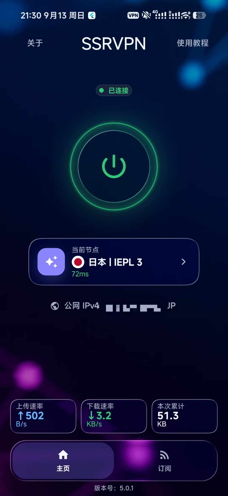
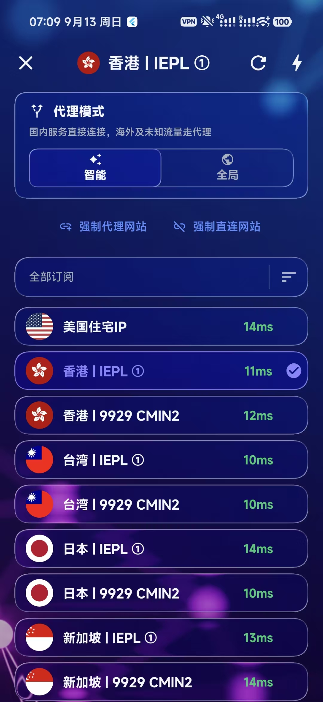

<div align="center">

# SSRVPN

**简单、开源的跨平台代理客户端**

支持 Android、macOS 和 Windows。导入订阅，选择节点，一键连接。

[](https://github.com/Elegying/SSRVPN/releases/latest)
[](https://github.com/Elegying/SSRVPN/actions/workflows/ci.yml)
[](#许可证)

[下载](#下载) · [快速开始](#快速开始) · [使用指南](docs/USER_GUIDE.zh-CN.md) · [反馈问题](SUPPORT.md)

</div>

SSRVPN 基于 Mihomo（Clash Meta），提供订阅管理、节点测速、智能分流和实时流量查看。三端采用统一的液态玻璃界面，日常操作集中在“主页”和“订阅”两页。

本项目只提供客户端，不提供代理节点或订阅服务。使用前请准备兼容 Mihomo 的订阅链接或节点链接。

## 下载

| 平台 | 系统要求 | 最新安装包 |
| --- | --- | --- |
| Android | Android 7.0+，arm64-v8a | [下载 APK](https://github.com/Elegying/SSRVPN/releases/latest/download/SSRVPN.apk) |
| macOS | macOS 11+，仅支持 Apple M 系列芯片 | [下载 DMG](https://github.com/Elegying/SSRVPN/releases/latest/download/SSRVPN.dmg) |
| Windows | Windows 10/11，x64 | [下载安装器](https://github.com/Elegying/SSRVPN/releases/latest/download/SSRVPN_Setup.exe) |

版本说明、SHA-256 校验文件和发布来源记录见 [GitHub Releases](https://github.com/Elegying/SSRVPN/releases/latest)。安装前请核对校验文件。

macOS 安装包采用 ad-hoc 签名、未经公证；Windows 安装器未签名。首次打开时可能出现 Gatekeeper 或 SmartScreen 提示，详情见[安装与使用指南](docs/USER_GUIDE.zh-CN.md)。

## 界面预览

Android 5.0.1 实机截图：已连接主页与节点选择页，公网 IPv4 已遮挡。截图中的节点和延迟仅用于展示。

<p align="center">
  
  
</p>

## 快速开始

1. 下载并安装对应平台的客户端。
2. 打开“订阅”，导入订阅链接或节点链接。
3. 等待刷新与测速，选择一个可用节点。
4. 返回主页，点击连接，并按系统提示完成授权。

Android 使用系统 VPN；macOS 和 Windows 支持系统代理与 TUN。详细步骤见[使用指南](docs/USER_GUIDE.zh-CN.md)。

## 主要功能

- **订阅与节点**：导入、更新和管理订阅，测试节点延迟并切换节点。
- **智能与全局模式**：智能模式下国内服务直连，海外及未知流量走代理；也可设置强制代理或强制直连网站。
- **连接状态一目了然**：查看当前节点、公网 IPv4、上传与下载速率，以及本次代理累计流量。
- **三端统一界面**：液态玻璃卡片与动态背景，支持减少动态效果，低性能设备使用轻量材质。
- **诊断与更新**：内置诊断日志、错误提示和版本更新检查，正式安装包提供校验文件。

当前仅支持 IPv4，不支持 IPv6 节点和 IPv6-only 目标。更多说明见[完整功能列表](docs/FEATURES.zh-CN.md)。

## 帮助与隐私

连接或订阅遇到问题时，先查看[故障排查](docs/TROUBLESHOOTING.zh-CN.md)，也可以从应用日志入口打开“诊断与运行日志”，按提示定位问题。需要反馈时请阅读[获取帮助](SUPPORT.md)。

SSRVPN 不内置遥测，不自动上传日志；订阅、节点、设置和运行日志默认保存在本机。应用会为订阅更新、版本检查、路由规则刷新、DNS 解析、连通性检查、公网 IPv4 展示及代理连接发起必要的网络请求。

诊断报告默认脱敏，分享前仍请检查内容，不要公开订阅链接、节点密码或其他个人信息。安全漏洞请按[安全政策](SECURITY.md)私下报告。

## 参与开发

项目使用 Flutter 构建界面，三端共用 `packages/ssrvpn_shared` 中的业务逻辑，系统 VPN、代理与安装流程由各平台实现。

开发环境固定为 Flutter **3.44.1**。配置好对应平台的工具链后，在仓库根目录运行：

```bash
make verify
```

验证入口会检查工具链版本、资源、静态分析、测试和覆盖率。平台构建与安装仍需在对应环境验证。

- [贡献指南](CONTRIBUTING.md) · [测试说明](docs/TESTING.md)
- [发布检查清单](docs/RELEASE_CHECKLIST.zh-CN.md) · [免费分发与签名说明](docs/RELEASE_SIGNING.md)
- [项目状态](docs/PROJECT_HEALTH.md) · [路线图](docs/ROADMAP.md) · [全部文档](docs/README.md)

## 许可证

SSRVPN 自有代码采用 [MIT License](LICENSE)。内置 Mihomo、Android Mihomo 分支和 GeoIP 数据库遵循各自许可证，详见[第三方许可清单](third_party/THIRD_PARTY_NOTICES.md)。

使用和参与项目时，请遵守[可接受使用政策](ACCEPTABLE_USE.md)与[社区行为准则](CODE_OF_CONDUCT.md)。重新分发或修改版本请阅读[名称与官方版本说明](TRADEMARKS.md)。

## 免责声明

SSRVPN 是开源网络客户端，供合法授权的网络连接、管理与技术研究使用。本项目不提供代理节点、订阅或国际联网接入服务，也不授权或鼓励任何违法用途。

使用者应遵守所在地及使用行为适用的法律法规。在中国境内使用时，应遵守网络安全、数据安全及计算机信息网络国际联网等相关规定，依法使用获准的网络接入服务，不得利用本软件从事违法跨境联网、未经授权的访问、传播违法信息或侵害他人权益等活动。开源、免费或用于学习研究，不代表具体使用行为当然合法。

软件按[许可证](LICENSE)以“现状”提供。在适用法律允许的范围内，开发者和贡献者不对软件的适用性、持续可用性或使用结果作出保证；使用者应依法对自身的配置、接入服务和使用行为负责。**本声明不排除或限制任何依法不得免除的责任，也不能替代所需的许可、批准或法律义务。**

对具体使用或分发方式的合法性有疑问时，请事先咨询具备相应资质的法律专业人士。另见[可接受使用政策](ACCEPTABLE_USE.md)。
