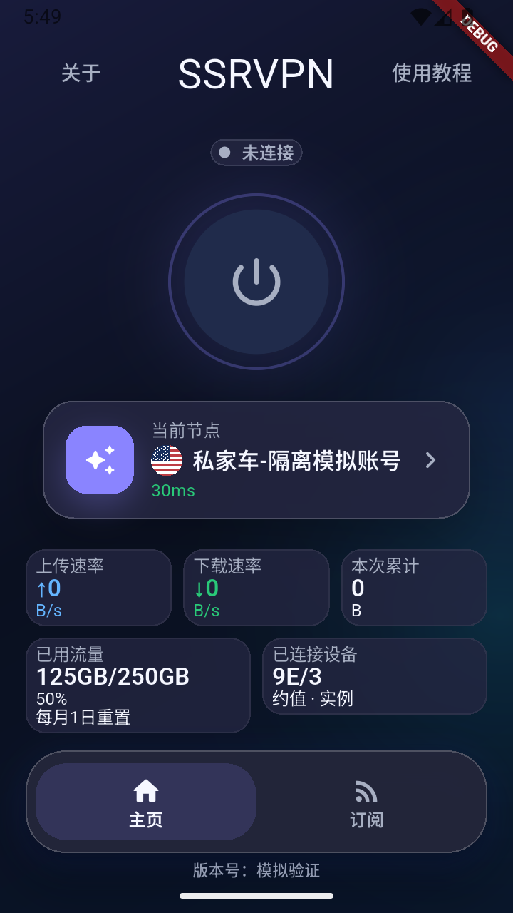
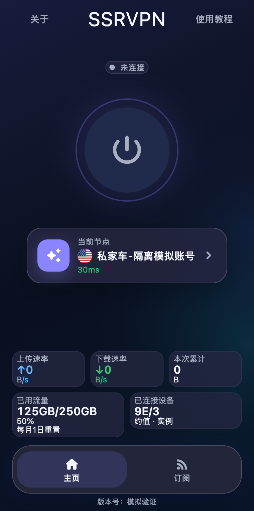
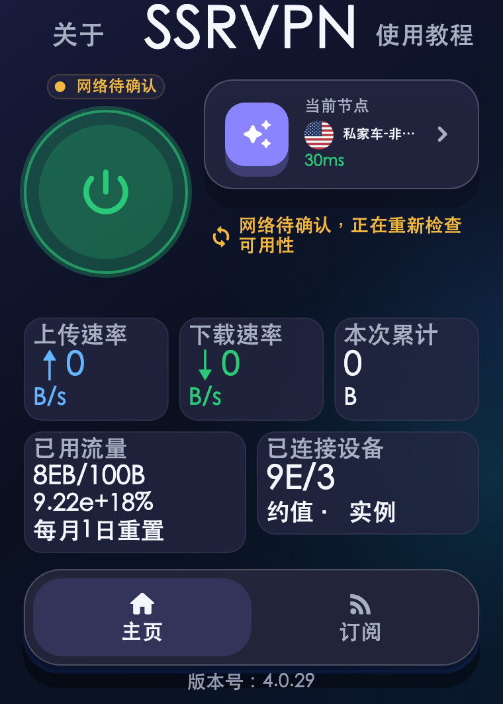
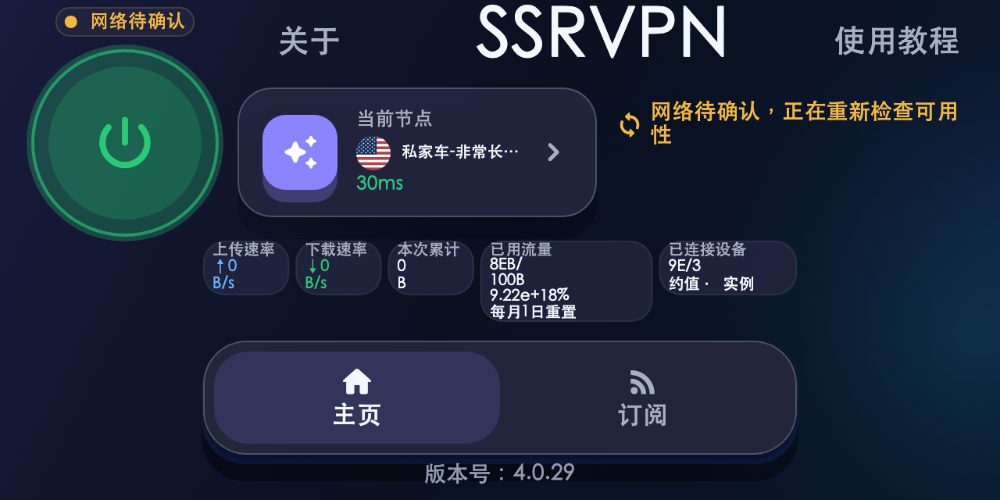

# 账号流量额度与重置提醒验证（4.0.33）

三端共用 `formatAccountUsage` 与 `SsrvpnHomeTrafficPanel`。卡片依次显示
「已用流量」、`125GB/250GB`、`50%`、「每月1日重置」。用量、额度分别来自同次
有效面板响应的 `usedBytes`、`trafficLimitBytes`，各自按原有 1024 进位规则自动
选择 B/KB/MB/GB/TB/PB/EB；没有写死 250GB。提醒为产品文案，客户端不按本地
日期清零，始终显示服务端实际值。接口与可信归属配置继续使用
[CLIENT_USAGE_API_V1.md](CLIENT_USAGE_API_V1.md)。

零额度仍为有效数据，比例显示 `—%`；非零不足 0.1% 显示 `<0.1%`，超额不截断，
达到 10000% 使用科学计数法。无障碍语义保留两个原始字节数。

## 自动化与布局证据

固定 Flutter 3.44.1，实际执行：

```sh
mise exec flutter@3.44.1 -- make verify
# 以下在 packages/ssrvpn_shared 目录执行
mise exec flutter@3.44.1 -- flutter test \
  test/account_usage_format_test.dart test/account_usage_layout_test.dart \
  test/home_overview_spacing_test.dart test/home_node_center_test.dart \
  --reporter expanded \
  --dart-define=SSRVPN_LAYOUT_OUTPUT=/private/tmp/ssrvpn-account-usage/dist/quota-reset-4033 \
  --dart-define='SSRVPN_LAYOUT_FONT=/System/Library/Fonts/STHeiti Medium.ttc' \
  --dart-define=SSRVPN_LAYOUT_ICONS=/Users/jared/.local/share/mise/installs/flutter/3.44.1/bin/cache/artifacts/material_fonts/MaterialIcons-Regular.otf
```

最终布局/格式测试 270 项通过；包括 64 项额度格式与尺寸边界、206 项既有首页回归。
504 份布局记录、81 份间距记录、756 次连续缩放状态检查均通过；72 组安全区/连接
状态检查保留节点几何居中。手机宽度 320/360/390、桌面现有最小窗口及横屏均覆盖，
字体缩放 1.0/1.5/2.0，大流量、长设备数/节点名、错误提示及三卡/五卡切换均覆盖。
断言包含文字不裁切、控件不重叠/越界、无 Scrollable 和实际滚动位移、操作可点击、
切换后无残余间距；最小字号 10 逻辑像素，数值更新不改变卡片尺寸。

已确认的紧凑桌面与高窗口节点定位规则保留。极矮横屏中，统计区低于 100px 时
将额度在斜杠处换行，局部内边距与行高缩紧；仅该横屏连接圆从 124px 调为 120px，
为新增提醒腾出空间。未扩大最小窗口、增加滚动或缩放整页。

本地 `make verify` 全部通过：共享 1043 项、Android 289 项、macOS 316 项、Windows
Flutter 293 项通过（本机 7 项 Windows API 测试按平台跳过）。随后新增的 27 项阈值
边界包含在最终 270 项验证与精确 PR CI 中；PR CI 共享总计 1070 项通过，覆盖率
87.34%（8063/9232）。格式、静态分析、秘密扫描、发布工具、性能和本机可执行原生
门禁均通过。没有把早期失败尝试计作通过，也没有放宽门禁。

## 原生运行与边界

- Android：专用隔离模拟器、360×640 逻辑屏幕，本地 HTTPS 模拟服务与共享生产组件。
  9 步通过：普通节点/首次等待/有效零值/真实 Home 后台两秒恢复/本机连接/断开/
  失败隐藏/恢复额度/回普通节点。恢复显示 `125GB/250GB 50%` 及重置提醒；提示
  随两块账号卡原子显示隐藏。系统截图已审查。初次模拟器响应过慢，冷启动恢复；
  隔离宿主额外的 RepaintBoundary 导致后台系统截图缺少静态绘制，移除该仅用于
  取图的包装后重跑通过，未为此修改生产 UI。
- macOS：隔离原生宿主 8 步 HTTPS 场景通过，380×762/763 可用视口中的节点中心
  与主页中心一致，额度与提醒完整可见。使用本地模拟账号，不代表生产 VPN 实机验收。
- Windows：PR CI 原生构建、策略测试和安装器全新安装/升级/未标记旧版本升级/
  卸载通过，日志逐份确认成功；本机无 Windows 交互桌面，未声称实际运行其 UI。
- 本次未修改生产面板或真实账号，未操作 USB 正式客户端；真实面板接口配置沿用
  已部署的 HTTPS 可信提供方。本次新增额度场景用隔离服务验证，没有编造线上查询结果。

| Android 系统截图 | macOS 原生截图 |
| --- | --- |
|  |  |

| 最小桌面与两倍字体 | 极矮横屏 |
| --- | --- |
|  |  |

全部原始截图、测量 JSON、测试日志、隔离宿主源码及运行驱动保存在本地交付目录
`dist/release-v4.0.33/validation`，不含真实账号凭据。

## 正式交付

[PR #211](https://github.com/Elegying/SSRVPN/pull/211)、
[精确 main CI](https://github.com/Elegying/SSRVPN/actions/runs/34025766797)、
[Prepare](https://github.com/Elegying/SSRVPN/actions/runs/34025778428)、
[Release](https://github.com/Elegying/SSRVPN/actions/runs/34026493664) 完成。
正式源码 `e6c302f3000b372835ad4c043a48d8c64b3a611c`，公开时间 `2026-09-06T10:19:35Z`，Release ID `383541265`。
GitHub 与 OSS latest、三端固定/版本化完整下载、SHA256 sidecar、API digest 均独立核对。
三份 attestation 校验绑定精确源码、标签与工作流；Android原签名及版本号、macOS
DMG/代码签名/版本、Windows正式安装器的安装/升级/卸载记录均已核验。
