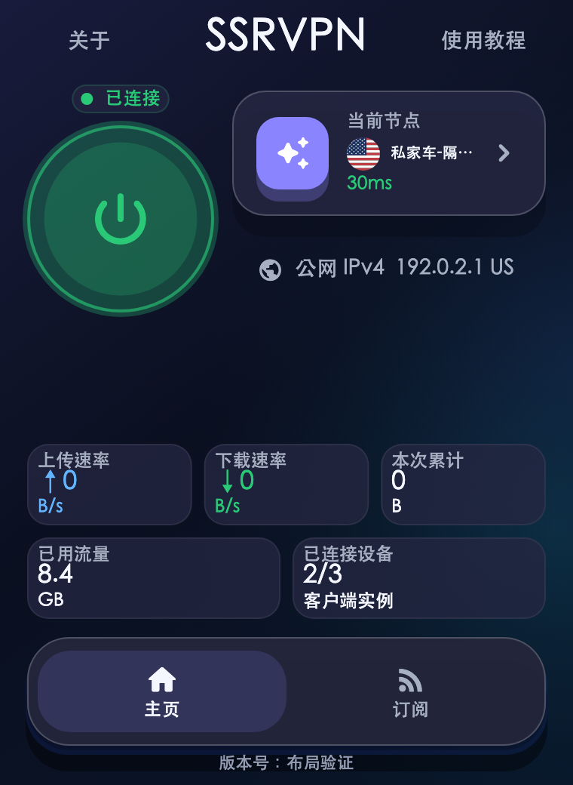
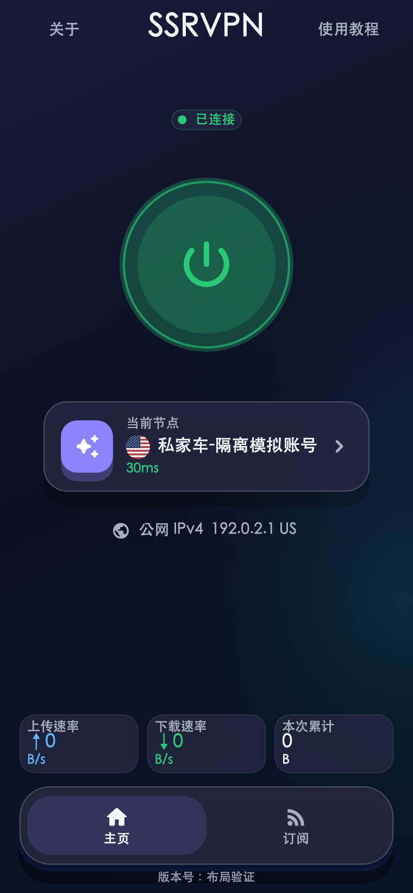
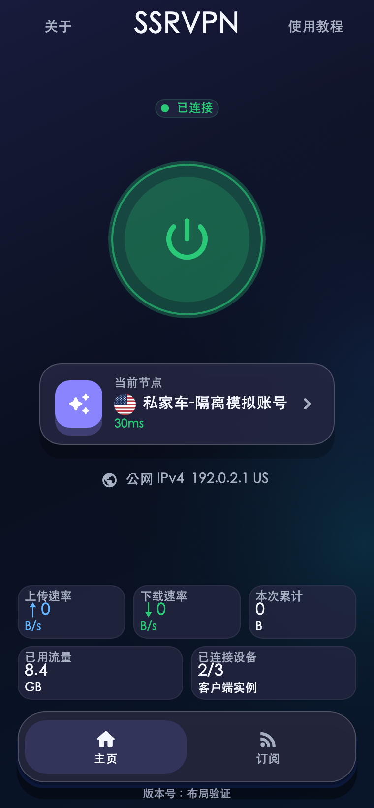
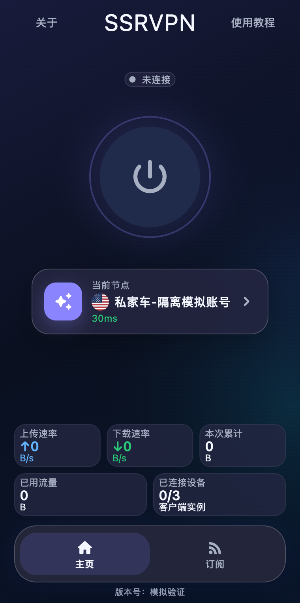
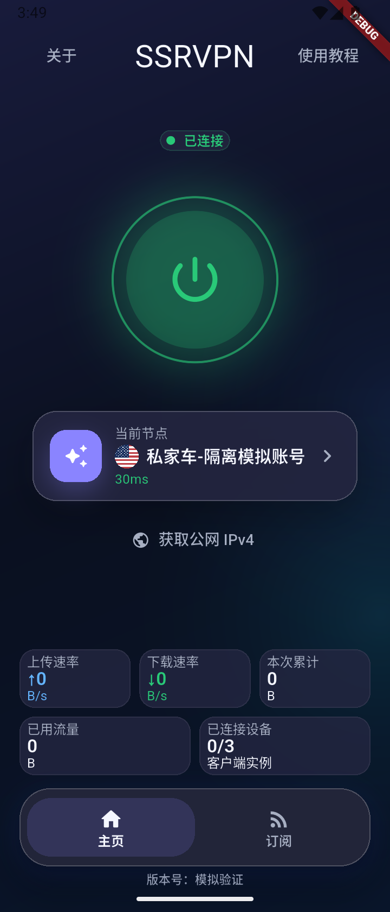

# 首页节点居中验证（4.0.32）

本次只增加高窗口纵向布局规则：扣除系统/标题栏安全区后的整个主页（包括底部导航）
作为居中基准，节点卡自身中心固定在该区域中点。顶部启动提示占用也会扣除；
账号三卡/五卡切换和本机连接/断开不会移动节点卡中心。

高度受限时沿用 4.0.31 布局，尤其维护者确认的紧凑并排布局保持不变。
高窗口条件为首页 overview 在顶部 SafeArea 内、4px 内边距外高度至少 610 逻辑像素。
统计区仍贴底，节点到公网 IPv4 至少 12px；没有提高最小窗口、增加滚动或修改账户/代理行为。

## 已执行的布局验证

固定 Flutter 3.44.1，在 `packages/ssrvpn_shared` 执行：

```sh
mise exec flutter@3.44.1 -- flutter test \
  test/account_usage_layout_test.dart \
  test/home_overview_spacing_test.dart \
  test/home_node_center_test.dart --reporter expanded \
  --dart-define=SSRVPN_LAYOUT_OUTPUT=/private/tmp/ssrvpn-account-usage/dist/center-4032 \
  --dart-define='SSRVPN_LAYOUT_FONT=/System/Library/Fonts/STHeiti Medium.ttc' \
  --dart-define=SSRVPN_LAYOUT_ICONS=/Users/jared/.local/share/mise/installs/flutter/3.44.1/bin/cache/artifacts/material_fonts/MaterialIcons-Regular.otf
```

结果：206 项通过。包含手机 320/360/390 宽度、桌面最小窗口及连续缩放、横屏，
字体缩放 1.0/1.5/2.0，长节点名、大数值、错误提示、三卡/五卡往返。
测量断言覆盖控件/文字位于视口、不重叠、不裁切、无滚动范围/位移、连接和导航点击、
统计边缘与导航齐平、3→5→3 无残余间距。最小测试字号保持 10 逻辑像素。
额外 72 组安全区/连接状态检查覆盖 Android 上下 24px、macOS 28px、Windows 40px，
以及顶部提示；节点卡中心误差不超过 0.1 逻辑像素。

380×520、380×532、380×560 三种小窗口的三卡/五卡六张 PNG 与 4.0.31 基准
逐字节相同，直接证明已确认布局未改变。JSON 测量与比对结果归档于本地交付目录。

| 紧凑布局保持 | 高窗口三卡 | 高窗口五卡 |
| --- | --- | --- |
|  |  |  |

## 原生环境与门禁

隔离 Android 模拟器原生宿主在 360×840 逻辑屏幕使用共享生产组件和本地 HTTPS
模拟接口，九步成功：普通节点、首次等待、有效零值、真实 Home 切后台两秒恢复、
本机连接、断开、刷新失败、恢复大流量、回普通节点。系统截图确认恢复后五卡完整。
仅操作 `test.ssrvpn.usage_smoke`，未接触 USB 手机、正式 VPN 会话或真实凭据。

完整 `mise exec flutter@3.44.1 -- make verify` 通过：共享 1006 项（覆盖率 87.65%）、
Android 289 项、macOS 316 项、Windows Flutter 293 项；本机 7 项 Windows API 测试
按系统限制跳过。Android 原生单测、macOS XCTest、格式、静态检查、版本/职责边界、
秘密扫描、发布工具和覆盖率门槛全部通过。

隔离 macOS 宿主的初始 storyboard 覆盖了预设尺寸，首次实际只有 380×600，
因此“高窗口中心”断言正确失败。宿主在窗口就绪后设置测试尺寸，系统最终可用视口
380×762，八步检查全部通过；所有步骤节点卡中心均为 (190,381)，包括连接/断开、
三卡/五卡、请求失败/恢复。该调整只在临时测试宿主中，产品启动规则未改变。
macOS 窗口截图工具一次超时未计为通过；下图来自原生 Flutter 渲染及 Android 系统截图。

| macOS 原生宿主 | Android 原生宿主后台恢复 |
| --- | --- |
|  |  |

产品代码经 [PR #209](https://github.com/Elegying/SSRVPN/pull/209) 和完整三端
[PR CI](https://github.com/Elegying/SSRVPN/actions/runs/34020379011) 通过，
合并源码为 `3f123e0d0c6cbff86d02529c94f5fc310c967f12`。
Windows CI 实际安装、覆盖升级、卸载日志均独立确认成功。
共享/宿主测试不等于三端正式客户端真机验收；本地没有 Windows 桌面运行环境。

## 正式交付

[v4.0.32](https://github.com/Elegying/SSRVPN/releases/tag/v4.0.32) 于 `2026-09-06T08:52:59Z`
正式公开。精确 main CI `34020954461` 与 Release `34021696215` 最终成功。
首轮 Prepare 等待因低速上传作业取消而失败；发布阶段使用同一草稿和原产物重试完成。三端公开文件、固定/版本化下载及来源证明独立核验通过，详见
[项目健康与发布状态](PROJECT_HEALTH.md)。
